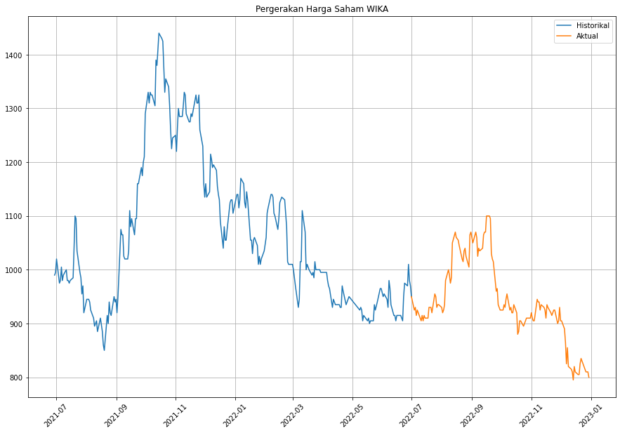
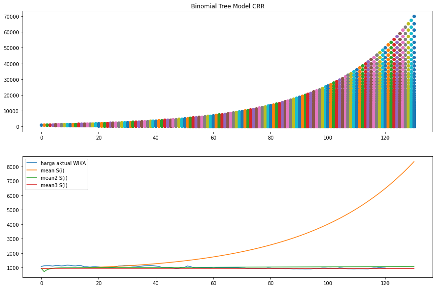
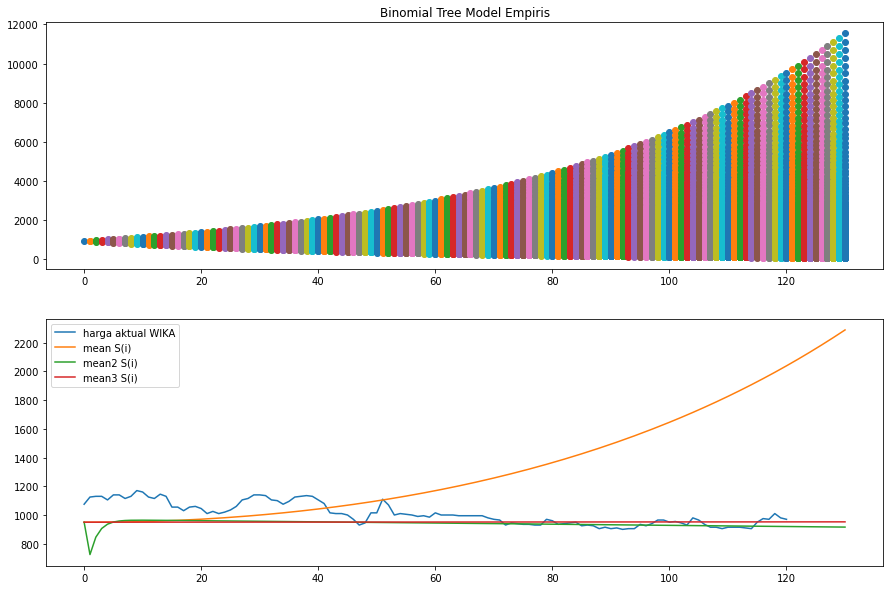
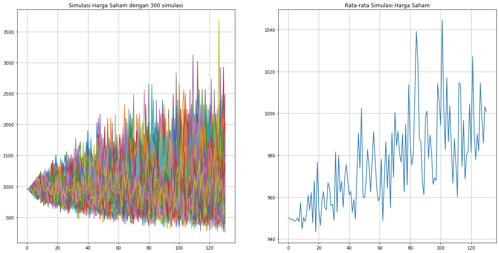
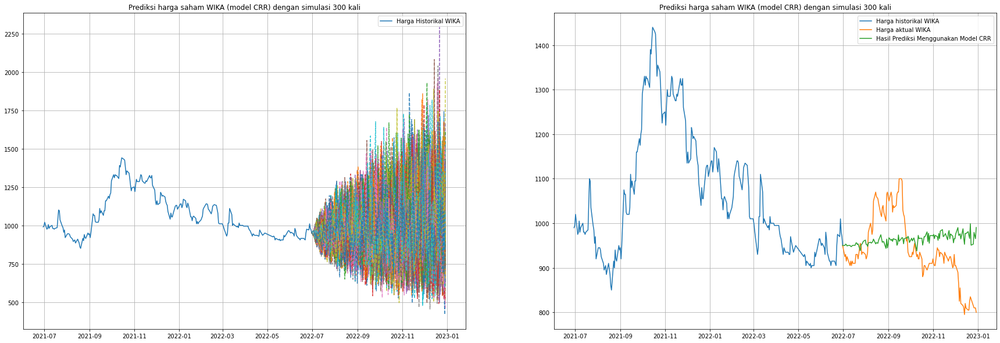
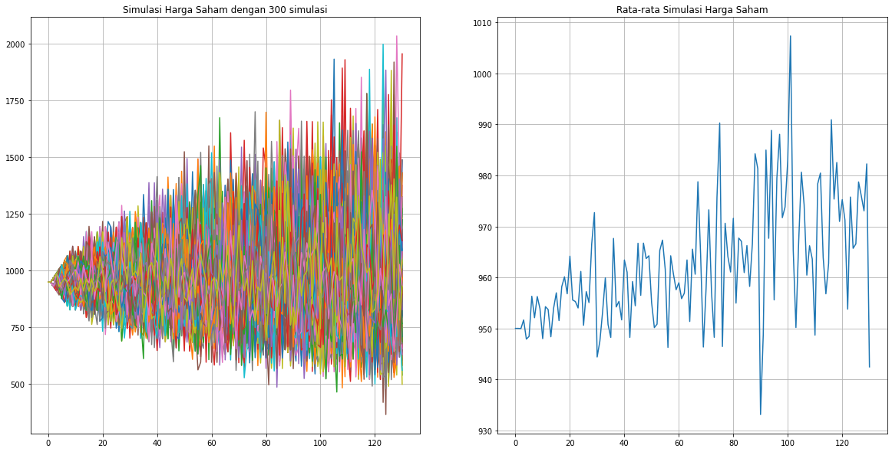
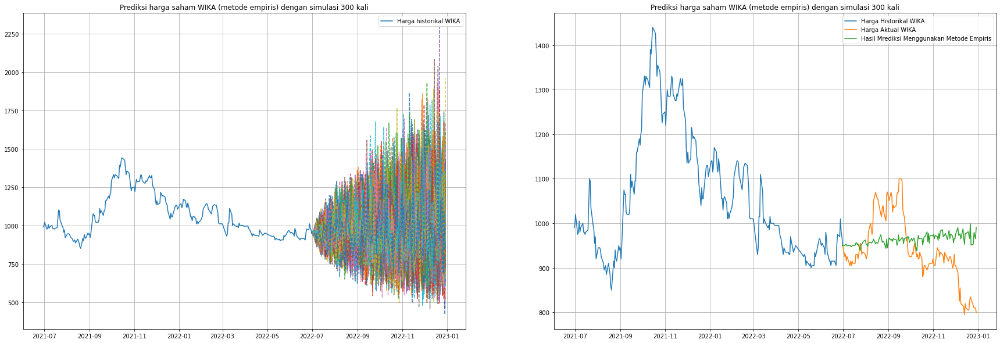
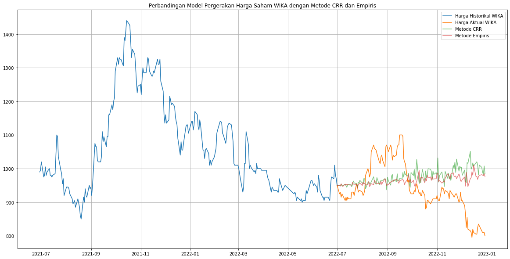

## Model Pergerakan Harga Saham Binomial Emiten WIKA

Tugas Besar Pemodelan, Simulasi, dan Optimasi

---

## Anggota Kelompok
1. Ariq Heritsa Maalik (1305213031)
2. Nadya Khairani (1305210069)
3. Muhammad Baari Adli (1305213081)

---

## Latar Belakang

---

#### Pergerakan Harga Saham WIKA

---

#### Model Pergerakan Harga Saham

Pergerakan saham menggunakan pendekatan binomial, dimana pergerakan harga saham pada hari berikutnya hanya bergantung pada pergerakan harga saham pada hari sebelumnya.

Harga saham hari ini: $S_0$

$$
S(1) = \begin{cases}
    S_0 \times u &, \text {dengan peluang p} \\
    S_0 \times d &, \text {dengan peluang q}
\end{cases}
$$

---

#### Estimasi Parameter Pada Model Binomial

Estimasi parameter dapat dilakukan dengan dua cara:
1. Menggunakan model CRR
2. Menggunakan pendekatan empiris

---

#### Model CRR

Merupakan perhitungan teoritis berdasarkan model Binomal versi **C**ox, **R**oss, & **R**ubeinstein.

$$u = e^{\sigma \sqrt{\Delta t}} $$

$$d = e^{-\sigma \sqrt{\Delta t}}$$

$$p = \frac{e^{\mu \Delta t} - d}{u - d}$$

---

#### Pendekatan Empiris

$$f= \frac{S(n)}{S(n-1)}$$

Parameter $u$ dan $d$ dapat diestimasi dari data historis 1 tahun. Maka

$$p \approx \frac{\text{Frekuensi} f_i \ge 1}{\text{banyaknya diskritisasi waktu dalam setahun}}$$

---

#### Pohon Binomial

---

### Persiapan Simulasi Monte Carlo

Urutan algoritma:
1. Tentukan $S_0, σ, r$
2. Hitung nilai faktor perubahan harga $u, d$
3. untuk setiap n = 1,2,··· ,N lakukan sebanyak M kali:

$$S(n) = S_0 u^x d^{n-x}, \text{with } X \sim BINOM(n, p)$$

---

### Hasil Simulasi Model CRR

---

### Hasil Simulasi Model CRR

---

#### Hasil Simulasi Metode Empiris

---

#### Hasil Simulasi Metode Empiris

---

#### Perbandingan Hasil Simulasi

---

#### Perhitungan Error

| Model   | MSE     | MAPE |
|---------|---------|------|
| CRR     | 8804.92 | 8.52 |
| Empiris | 6763.06 | 7.43 |

Metode Empiris lebih akurat karena perhitungan error lebih kecil dibandingkan dengan model CRR.

---

# Thank You